# How Amazon Aurora PostgreSQL Works

Amazon Aurora PostgreSQL looks like PostgreSQL to your application, but under the hood it is a very different database. The biggest idea is simple: **compute and storage are separate services**. The writer and reader instances run the Postgres-compatible engine; a distributed, log-structured storage layer holds durability, replication, and page materialization.

This post walks through that architecture in plain language—from redo logs and 10 GB protection groups, to LSNs, quorum repair, how queries actually run, and where RDS Proxy fits. Where examples show redo records as JSON, they are **simplified for teaching**, not the exact on-wire format.

---

## 1. Compute vs storage: Aurora vs traditional Postgres / RDS

### Traditional PostgreSQL (and classic RDS)

In a classic PostgreSQL deployment (including Amazon RDS for PostgreSQL on a single instance), one machine owns both:

- The **database engine** (connections, SQL planner, executor, buffer cache, locks)
- The **data files** (heap pages, indexes, WAL) on attached or network disks

Writes follow the classic write-ahead log (WAL) pattern: change a page in the buffer cache, append a WAL record, flush WAL for durability, then later flush dirty pages. Replicas typically get a **stream of WAL** and rebuild their own local copies of the data files. That means:

- Scaling reads often means copying data again
- Failover and replica promotion involve storage that is tied to instances
- Disk I/O is dominated by both WAL *and* page writes

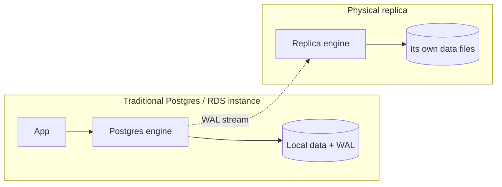

### Aurora’s split

Aurora splits those responsibilities:

| Layer | What it does | What it does *not* do |
|-------|----------------|------------------------|
| **Compute** (writer / readers) | SQL, transactions, buffer cache, locks, generate redo | Persist the durable copy of the database volume |
| **Storage service** | Accept redo, quorum-replicate, coalesce into pages, repair, backup to S3 | Run your SQL queries |

The cluster volume is a **single logical volume** shared by the writer and all Aurora Replicas. Adding a reader does **not** copy the dataset; the new instance attaches to the same volume and warms its own memory cache as queries run.

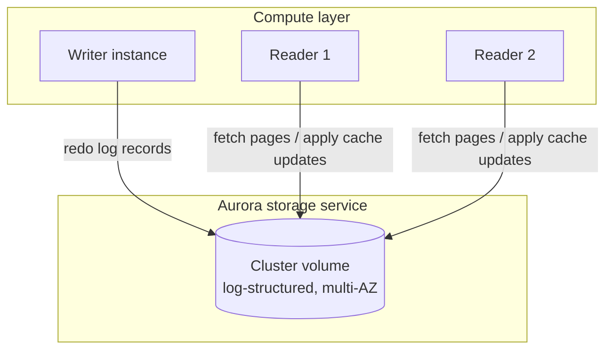

**Concrete example:** You run `UPDATE accounts SET balance = balance - 50 WHERE id = 42`. On classic Postgres, that dirty page eventually hits the instance’s disks, and replicas replay WAL into *their* disks. On Aurora, the writer mostly ships **redo log records** to the storage fleet; storage nodes make those durable with a quorum, and later turn redo into page versions. Readers do not maintain a second full on-disk database.

---

## 2. How the writer creates redo logs, holds them in memory, and streams them to storage

Aurora’s storage is **log-structured**. The writer still thinks in familiar database terms (pages, mini-transactions, commit), but what crosses the wire to storage is primarily a stream of **redo log records**, each tagged with a **log sequence number (LSN)**.

### High-level write path

1. A client commits a change (or a mini-transaction completes).
2. The writer generates one or more redo records describing the change.
3. Records sit briefly in the writer’s memory (log buffer / outbound queues) while they are ordered and batched.
4. The writer **streams** those records to the storage nodes that own the relevant segment of the volume.
5. Storage acknowledges durability under a **write quorum** (details in later sections).
6. Only then does the engine treat the commit as durable from the client’s point of view.

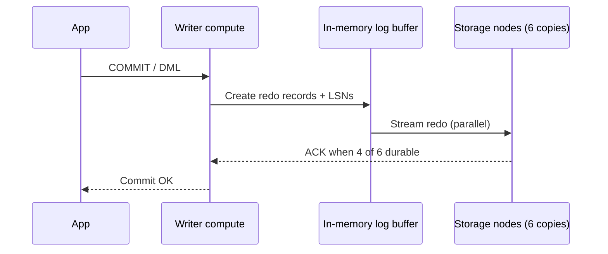

### Simplified redo log examples (educational)

> **Note:** Real Aurora / Postgres WAL records are binary, tightly packed, and engine-specific. The JSON below is a **teaching simplification** of the *ideas* (LSN, page identity, operation, after-image fragments)—not the on-wire format.

**Example A — update a single tuple on a heap page**

```json
{
  "lsn": 10042,
  "type": "HEAP_UPDATE",
  "relation": "public.accounts",
  "page": { "tablespace": 1663, "db": 16384, "relfilenode": 16400, "block": 17 },
  "tuple_offset": 3,
  "before": { "balance": 500 },
  "after": { "balance": 450 },
  "xid": 9012,
  "cpl": false
}
```

**Example B — index leaf change accompanying the same update**

```json
{
  "lsn": 10043,
  "type": "BTREE_UPDATE",
  "page": { "relfilenode": 16405, "block": 88 },
  "key": { "account_id": 42 },
  "pointer": { "block": 17, "offset": 3 },
  "xid": 9012,
  "cpl": false
}
```

**Example C — end of a mini-transaction (consistency point)**

```json
{
  "lsn": 10044,
  "type": "MTR_COMMIT",
  "xid": 9012,
  "cpl": true,
  "comment": "Final record of a mini-transaction; tagged as a Consistency Point LSN (CPL)"
}
```

In Aurora’s design (as described in AWS materials such as the Aurora design paper and storage blogs), a user transaction is broken into **mini-transactions (MTRs)**. Each MTR is a contiguous run of log records that must apply atomically at the storage layer. The **last** record of an MTR is marked as a **Consistency Point LSN (CPL)**. That distinction matters for recovery and for what “durable” means across a distributed volume (see the LSN section below).

### Why streaming redo is cheaper than shipping pages

Sending redo instead of full dirty pages shrinks network and I/O. AWS has long described Aurora as needing far fewer IOPS than MySQL for comparable workloads because storage receives log records—not full page images—on the critical path, and those writes go out in parallel to the protection group.

---

## 3. How storage keeps redo, when it hits disk, and how ~10 GB shards form

### Inside a storage node (simplified)

When a storage node receives redo:

1. Records land in an **in-memory queue** and are **deduplicated** (retries from the writer must not double-apply).
2. Records are **hardened to disk** in a hot log—this is the durability step the node ACKs.
3. Records also enter an **update queue**, where they are **coalesced** and eventually used to build **data page versions**.
4. Older log that has been materialized can be garbage-collected; pages and logs are staged to **Amazon S3** asynchronously for continuous backup.

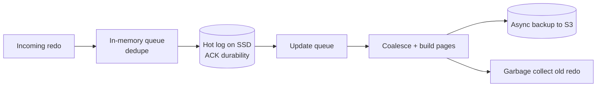

So: **durability of a write** is about getting redo into the hot log on enough nodes; **materializing readable pages** is an asynchronous, coalesced follow-on.

### Protection groups and ~10 GB segments

Aurora does not store the whole volume as one giant blob on six drives. It **partitions the cluster volume into fixed-size segments**—about **10 GB** each—called **protection groups (PGs)** in AWS documentation.

For each 10 GB protection group:

- Data is replicated to **six storage nodes**
- Those six are placed across **three Availability Zones** (typically two per AZ)
- The six copies form an independent quorum set for that segment

As your database grows, Aurora allocates more protection groups. A large volume can span thousands of storage nodes. Segment size is a deliberate trade-off: small enough that a failed copy can be **repaired in under a minute** on a fast network; large enough that the membership/repair machinery stays practical.

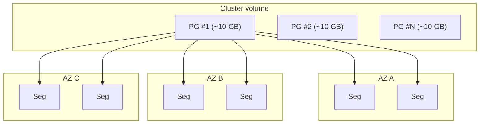

**Concrete example:** A 100 GB logical database is not “one 100 GB disk mirrored six ways.” It is roughly ten independent 10 GB protection groups, each with its own six-way placement and quorum. A failure in one PG repairs independently of the others.

---

## 4. Do readers store redo in memory? How does a reader know data changed?

### Shared storage, local caches

Readers **do not** keep a second durable copy of the database on local disk the way a classic streaming replica does. They attach to the **same cluster volume**. What each instance *does* keep is a **local buffer cache (page cache)** in memory for speed.

### How readers learn about changes

On Aurora PostgreSQL, DML on the writer produces transaction log records that are:

1. Sent to **storage nodes** (durability / shared volume), and
2. Also sent to **reader instances** so they can update pages that already sit in the reader’s buffer cache.

Behavior in practice:

- If the reader **has that page in cache**, it applies (or invalidates/updates) using those log records, in commit order, so the cache stays coherent.
- If the reader **does not** have the page, those cache-bound log records can be **ignored**; the next read will **fetch the current page from storage**, which already reflects durable writes.

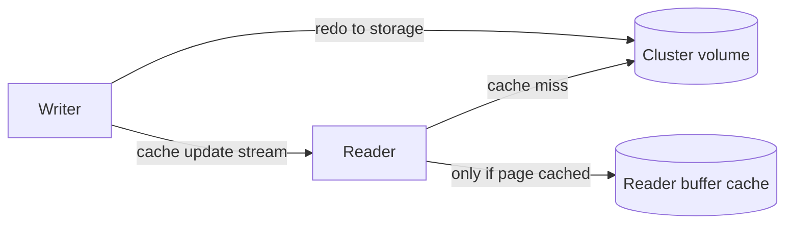

So readers may hold **some** redo-related state in memory (to update cached pages), but they are not a WAL archive, and they are not responsible for volume durability. Durability lives in the storage service.

**Concrete example:** Writer updates `accounts` page 17. Reader A has page 17 cached → it consumes the log update for that page. Reader B never touched page 17 → it ignores those records; when a query needs page 17, Reader B reads it from storage.

---

## 5. Replication lag — what it means in Aurora

In classic Postgres streaming replication, “lag” usually means: how far behind is the replica’s **WAL apply** / data files compared with the primary.

In **Aurora PostgreSQL**, the CloudWatch metric often called **ReplicaLag** / **AuroraReplicaLag** means something more specific:

> How far the **reader’s page cache** trails the writer’s view—not “is the shared disk missing data?”

Because all instances share the cluster volume, **storage already has the durable writes** (under quorum). Lag is about **asynchronous cache coherency** on the reader: applying or invalidating cached pages after the writer’s changes.

### Common causes

| Cause | What happens |
|-------|----------------|
| Write bursts | Many log records arrive; reader CPU/network struggles to keep cache updates current |
| Undersized readers | Reader instance class smaller than writer → cannot invalidate/apply as fast as changes arrive |
| Long-running reads | Buffer pins / recovery conflicts delay applying log updates (`max_standby_streaming_delay` can allow brief delay; excessive lag hurts freshness) |
| Heavy concurrent read load | Contends with apply work on the reader |

### How to think about it

- Lag is often **tens of milliseconds** in healthy clusters; spikes under load are normal to investigate, not always catastrophic.
- A cache miss on the reader still reads from **shared storage**, which is current with durable writes—so lag is more about **cached-page freshness and apply backlog** than about a second disk copy being stale.
- For “must see my own write” paths, send those reads to the **writer** endpoint.
- Monitor with CloudWatch `AuroraReplicaLag` and SQL such as `SELECT * FROM aurora_replica_status();` (fields like `replica_lag_in_msec`, `durable_lsn`, `highest_lsn_rcvd`, `current_read_lsn`).

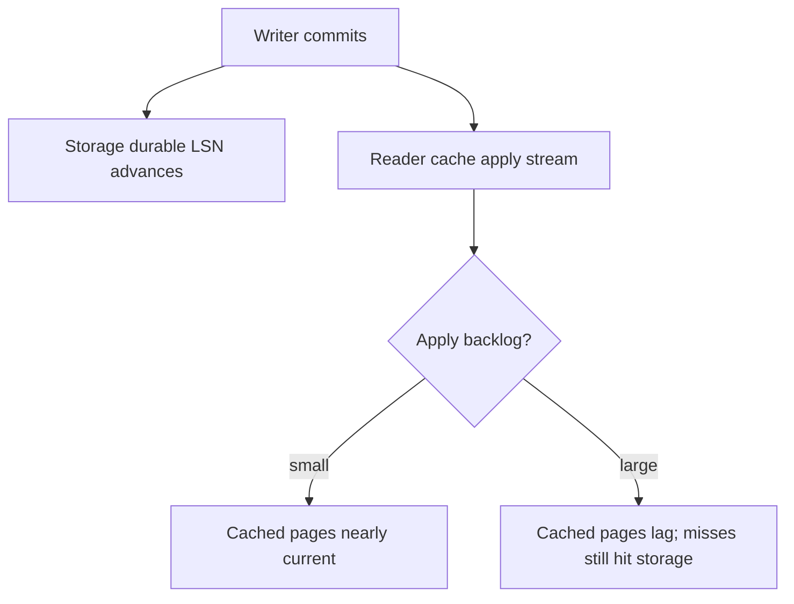

---

## 6. Coalescing multiple redo logs to minimize disk writes

Storage nodes do **not** rewrite a full data page to SSD for every tiny redo record. That would defeat the log-structured design.

Instead, after redo is durable in the hot log:

1. Records sit in the **update queue**.
2. Multiple records that touch the **same page** (or can be folded together) are **coalesced**.
3. Storage builds **new page versions** from the coalesced redo.
4. Old redo that has been fully incorporated can be **garbage-collected**.
5. Page versions and logs are **asynchronously** backed up toward S3.

**Concrete example:** Fifty updates hit block 17 of `accounts` in one second. Rather than fifty full page writes, the node may harden fifty small redo records quickly, then coalesce them into **one** (or a few) newer page versions before heavier page I/O and GC.

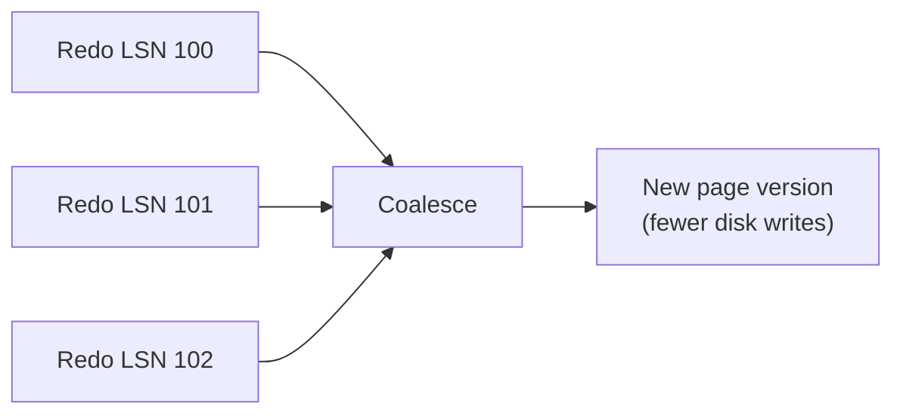

Group commit and parallel ACK paths on the way *into* storage further reduce latency: the engine and storage batch work so many transactions share the cost of durability rounds.

---

## 7. When one storage node falls behind: quorum, catch-up, peer repair

Aurora’s durability story rests on **quorums**, not on “all six copies always identical at every instant.”

### The baseline quorum (official AWS model)

For each protection group:

| Operation | Quorum |
|-----------|--------|
| **Write** | Acknowledge when **4 of 6** copies have persisted the redo |
| **Read / recovery completeness** | Need **3 of 6** caught up to the needed LSN (read quorum) |

Writes are **issued to all six**; you do not wait for the slowest. If one node is slow or briefly unavailable, the other ACKs still form a write quorum.

This layout (six copies, three AZs, write 4/6) is chosen so Aurora can tolerate:

- Loss of an **entire AZ** and still keep write availability (four copies remain), and
- An **AZ + one additional** failure without losing committed data (three copies remain for recovery), then rebuild the rest.

### Catch-up and gossip / peer-to-peer repair

If a node misses some LSNs (gap detection in the update path):

1. It detects **holes** in the LSN sequence for its segment.
2. It uses a **peer protocol (often described as gossip)** to fetch missing records from other members of the protection group.
3. Once complete, it continues coalescing and serving reads for LSNs it has caught up to.

If a node is permanently lost, membership protocols introduce a replacement segment; the new member is filled from surviving peers. Because segments are ~10 GB, **mean time to repair** stays short (AWS has described repairing a 10 GB segment in under a minute on a 10 Gbit network, plus detection hysteresis).

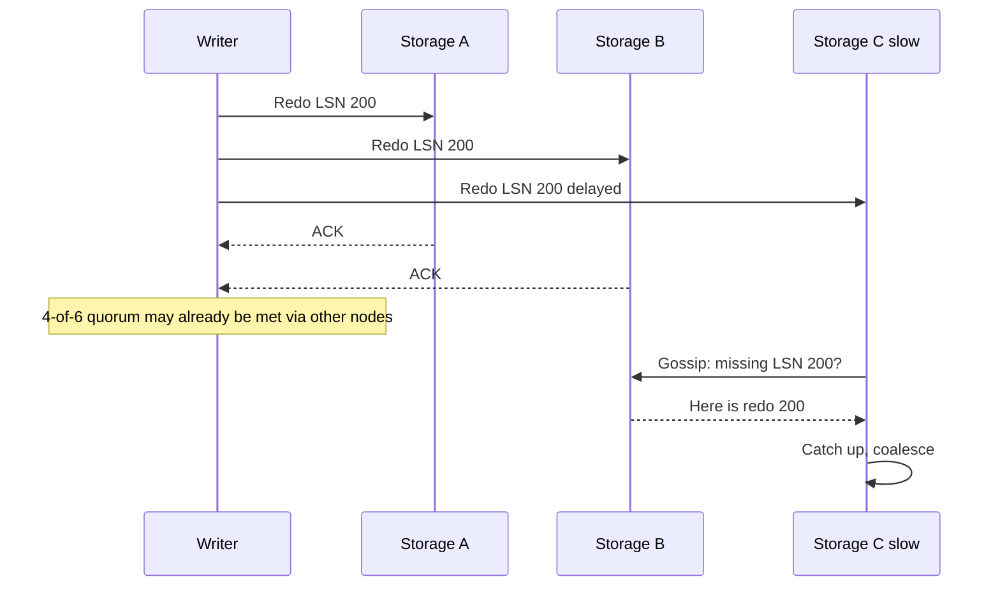

**Concrete example:** Nodes A–D ACK a commit; E is overloaded and F is restarting. The client still gets commit success. E and F catch up from peers; if F’s disk is dead, a new F′ is provisioned and backfilled from the surviving copies of that 10 GB PG only—not the entire database.

---

## 8. Readers, LSNs, volume complete LSN, and consistency points

LSNs are the backbone of ordering and consistency across a distributed volume.

### Key terms (as used in Aurora design materials)

| Term | Meaning (simplified) |
|------|----------------------|
| **LSN** | Monotonic log sequence number identifying a redo record |
| **VCL (Volume Complete LSN)** | Highest LSN such that **all prior** log records are known to be available in the volume (no gaps) |
| **CPL (Consistency Point LSN)** | LSN tagged by the database as an allowable truncation / atomic boundary (end of a mini-transaction) |
| **VDL (Volume Durable LSN)** | Highest **CPL ≤ VCL**—the durable consistency point the database can open on |

On recovery, storage may be complete up through some LSN (VCL) but must truncate above the durable consistency point (VDL). Example from the Aurora design discussion: complete through 1007, but CPLs only at 900, 1000, 1100 → durable truncation point is **1000**.

### How readers use LSNs

- Each read against storage is associated with an LSN (a consistency point the compute node is allowed to see).
- A storage node serves a page only if it is **caught up to that LSN**.
- Aurora prefers a nearby healthy storage node that satisfies the LSN.
- `aurora_replica_status()` exposes related progress fields such as `durable_lsn`, `highest_lsn_rcvd`, and `current_read_lsn` so you can see how writer, storage, and readers line up.

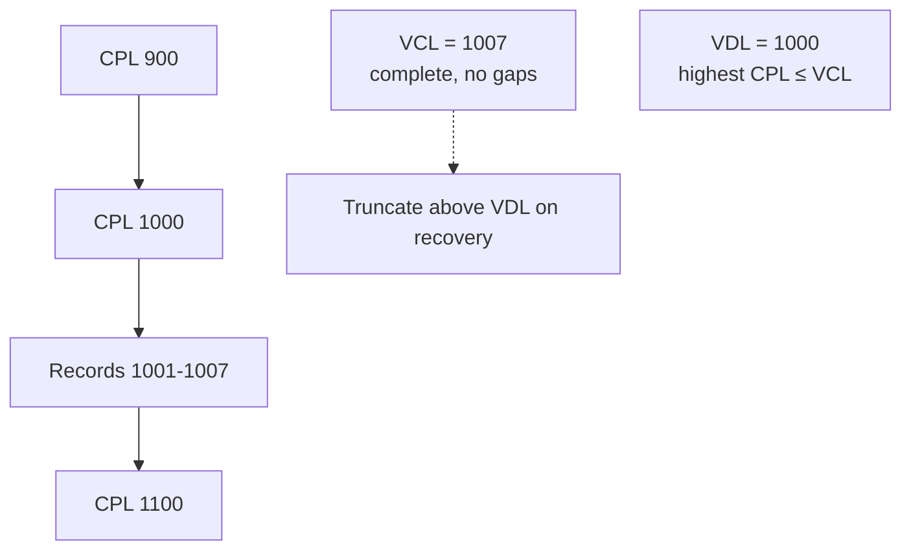

**Concrete example:** A reader starts a snapshot-style read view bound to a consistency LSN. Page fetches from storage must reflect all redo ≤ that LSN and none of the unsafe partial mini-transactions above the durable point.

---

## 9. How queries and joins work with distributed storage

A common misconception: “Aurora must run distributed MapReduce-style joins across storage nodes.”

**It does not.** Aurora’s storage is a distributed **page store / redo store**, not a query engine. Query planning and execution still happen on the **compute instance** (writer or reader), using a PostgreSQL-compatible planner and executor.

### What actually happens

1. Client sends SQL to a compute endpoint.
2. Planner builds a plan (seq scans, index scans, nested loop / hash / merge joins, etc.)—same *class* of ideas as Postgres.
3. Executor needs heap/index **pages**.
4. On **cache hit**, use the local buffer cache.
5. On **cache miss**, compute fetches the page from the Aurora storage service (the right protection group / segment), at an appropriate LSN.
6. Joins run **in the compute node’s memory / local temp space**, combining rows after pages are in cache—not as a shuffle join across storage workers.

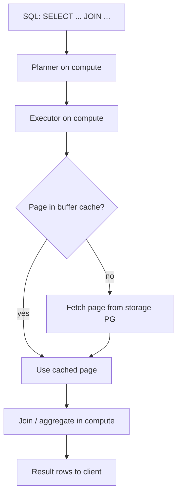

**Local temporary files** for sorts, hashes, and large materializations use **instance-local storage**, not the durable cluster volume (Aurora documents separate temporary storage limits per instance class).

**Concrete example:**

```sql
SELECT o.id, c.name
FROM orders o
JOIN customers c ON c.id = o.customer_id
WHERE o.created_at >= DATE '2026-01-01';
```

The reader might index-scan `orders`, look up `customers` by primary key, and hash-join in memory. Storage only answers: “give me page X of relation Y as of LSN Z.” It does not receive a MapReduce job description.

---

## 10. Sharding in Aurora PostgreSQL (storage segments vs app-level sharding)

“Sharding” is an overloaded word. In Aurora, distinguish carefully:

### Storage-level segmentation (built in)

- Volume split into **~10 GB segments / protection groups**
- Each PG replicated **6 ways across 3 AZs**
- Transparent to SQL: you still see one database, one set of tables
- Purpose: durability, parallel repair, incremental growth, multi-tenant storage efficiency
- **Not** something you partition by `user_id` in your schema

### Application-level sharding (your design)

- You split tenants or keys across **multiple databases / clusters**
- Application or a routing layer picks the shard
- You manage cross-shard queries yourself

### Citus / distributed Postgres extensions (different product model)

- Extensions like **Citus** turn Postgres into a distributed query processor with worker nodes and shard tables
- Coordinators push down queries; workers hold table shards
- That is a **compute-side distributed SQL** approach

Aurora’s PG segmentation is **not** Citus-style table sharding. You get one coherent Postgres-compatible engine over a shared distributed volume. If you need hash-sharded tables and distributed joins across workers, that is a different architecture (Citus, app sharding, or other distributed SQL systems)—not what Aurora’s 10 GB protection groups provide.

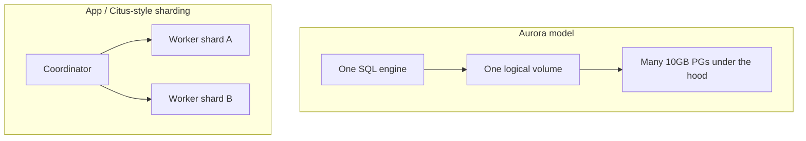

---

## 11. What RDS Proxy is and why it helps with Aurora

**Amazon RDS Proxy** is a fully managed **database proxy** that sits between your application and Aurora (or RDS). Your app connects to the proxy endpoint; the proxy manages pools of connections to the database instances.

### Main benefits

**1. Connection pooling and multiplexing**  
Opening Postgres connections is expensive (TLS, auth, memory). Serverless and microservice fleets can open thousands of short-lived connections and overwhelm `max_connections`. RDS Proxy pools connections to Aurora and multiplexes many app connections onto fewer database connections (with caveats around **pinning** when session state forces a 1:1 hold).

**2. Faster, gentler failover**  
On Aurora failover, DNS propagation is often a large part of client-visible downtime. RDS Proxy **monitors** instances and **routes** to the new writer **without relying on DNS alone**. It can keep **idle** client connections open across failover; only in-flight transactions/statements are canceled. New requests may be **queued** briefly until a writer is available (`ConnectionBorrowTimeout` and related settings control wait behavior).

**3. Safer credential handling**  
Proxy integrates with AWS Secrets Manager / IAM auth patterns so apps need not embed rotating DB passwords as aggressively.

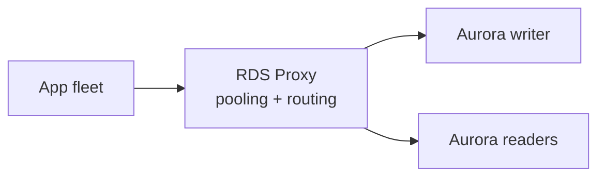

**Concrete example:** During a writer failover, 500 idle connections from an API tier stay connected to the proxy. In-flight checkouts fail fast and retry. When a former reader is promoted, the proxy directs write traffic there—clients avoid a thundering herd of reconnect + DNS wait that would otherwise amplify the outage.

RDS Proxy is optional: Aurora works without it. It shines when connection churn is high or failover UX matters.

---

## Putting it together

A single `COMMIT` on Aurora PostgreSQL touches every layer you just read:

1. **Compute (writer)** generates redo, assigns LSNs / CPLs, streams logs.
2. **Storage** accepts redo on the right **10 GB protection groups**, ACKs at **4-of-6**, coalesces, materializes pages, gossips to repair stragglers.
3. **Readers** refresh cached pages from the log stream; on miss they read the shared volume at a safe LSN.
4. **Queries** still plan and join on compute; storage serves pages.
5. **RDS Proxy** (if used) cushions connections and failover in front of that cluster.

That separation—Postgres-compatible compute over a quorum-replicated, log-structured, multi-AZ storage service—is the core of how Aurora PostgreSQL works.

### Further reading (official / primary sources)

- [Amazon Aurora storage (User Guide)](https://docs.aws.amazon.com/AmazonRDS/latest/AuroraUserGuide/Aurora.Overview.StorageReliability.html)
- [Introducing the Aurora Storage Engine (AWS Database Blog)](https://aws.amazon.com/blogs/database/introducing-the-aurora-storage-engine/)
- [Amazon Aurora under the hood: quorums and correlated failure](https://aws.amazon.com/blogs/database/amazon-aurora-under-the-hood-quorum-and-correlated-failure/)
- [Replication with Amazon Aurora PostgreSQL](https://docs.aws.amazon.com/AmazonRDS/latest/AuroraUserGuide/AuroraPostgreSQL.Replication.html)
- [RDS Proxy concepts](https://docs.aws.amazon.com/AmazonRDS/latest/AuroraUserGuide/rds-proxy.howitworks.html)
- Aurora design paper: *Amazon Aurora: Design Considerations for High Throughput Cloud-Native Relational Databases* (VCL / VDL / CPL discussion)

---

*Educational note: Internal queue names, exact repair timers, and binary log layouts evolve. Prefer current AWS documentation for production decisions; this post prioritizes the stable architectural model AWS has published.*
